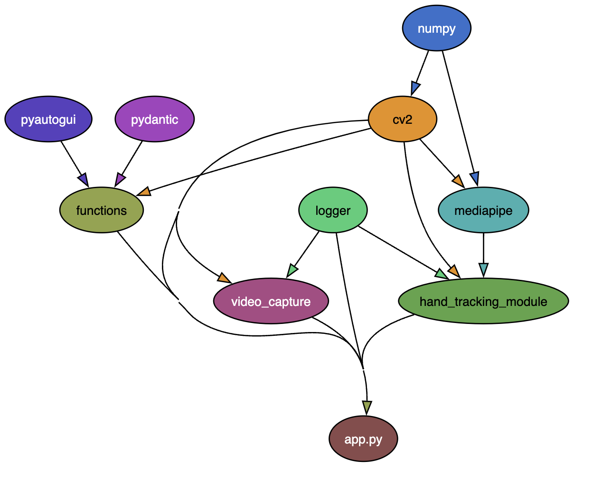

# one_app_challenge

## ルール
* ブランチはGit-flowに従う[参考](https://qiita.com/KosukeSone/items/514dd24828b485c69a05)
* 全てのクラスはpydanticを使用する[参考](https://zenn.dev/taka256/articles/c7213c359dd2cf)
    ```
    from pydantic import BaseModel, EmailStr, Field, validator

    class User(BaseModel):
        id: int = Field(..., gt=0, description="ユーザーIDは正の整数でなければなりません")
        name: str = Field(..., min_length=1, max_length=50, description="名前は1文字以上50文字以下でなければなりません")
        email: constr(min_length=2, max_length=10)
    ```
* 全ての関数には型ヒントと説明を以下のようにつける[参考](https://zenn.dev/taka256/articles/c7213c359dd2cf)
    ```
    def get_user_by_id(user_id: int) -> User:
        """
        指定されたIDのユーザーを取得する関数

        Args:
            user_id (int): ユーザーのID

        Returns:
            User: ユーザーオブジェクト
        """
        # ここにユーザーを取得するロジックを追加
        return User(id=user_id, name="John Doe", email="john.doe@example.com")
    ```
* 仮想環境にはpoetryを使ってほしい。時間がない場合は任意の仮想環境で良い
* flake8を使用して書式を整えてからMRを作成する 

## 実行方法
* src/ でpoetry shellを実行して仮想環境を構築する
* cd backで、``` python fast_gesture.py``` を実行する

## 依存関係を調べる
graphvizとpydepsをインストール
``` $ pydeps fast_gesture.py --max-module-depth=1``` のように調べたファイルを指定して実行する

